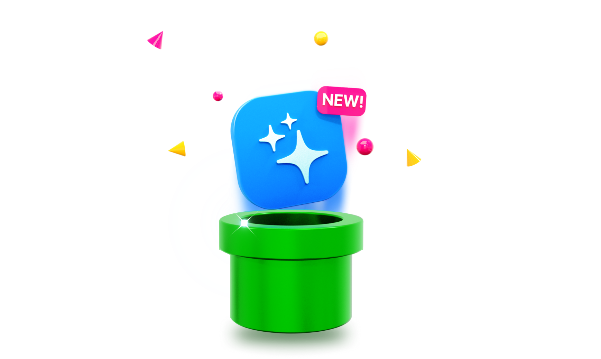

Bump is an automated pipeline for releasing apps with [Sparkle](https://sparkle-project.org)

**Features:**

* 🚀  Get an end-to-end Sparkle release pipeline running in 60 seconds
* ✍️  Create & maintain a Sparkle changelog from a single markdown file
* 🔐  Automatic Sparkle certificate and signature handling
* 📦  Automatic release versioning in your changelog and on S3
* 🔑  Bring your own AWS account
* 🚐  Can be [self-hosted](#running-locally--self-hosted)

Ready to try it? [Get started](#getting-started).

Please note;

* **Bump has not been tested with the Sparkle 2 Beta**. In theory it should be perfectly compatible but it has only been tested with Sparkle 1.x
* You'll need an **AWS access key and secret key** to use Bump as it automatically manages an S3 bucket for your Sparkle changelog file and app archives
* Bump has only been tested with macOS Sparkle releases, not Sparkle-compatible distributions available for other platforms
* Bump doesn't support Delta updates with Sparkle (yet!)

---

## Contents

- [Contents](#contents)
- [Getting started](#getting-started)
  - [1. Create a new repo using this template](#1-create-a-new-repo-using-this-template)
  - [2. Update variables](#2-update-variables)
  - [3. Create secrets](#3-create-secrets)
  - [4. Creating a  release](#4-creating-a--release)
- [Appendix](#appendix)
  - [S3 Information](#s3-information)
  - [App archive support](#app-archive-support)
  - [Release frontmatter](#release-frontmatter)
  - [Running locally / self-hosted](#running-locally--self-hosted)
  - [API Support](#api-support)
  - [Updating from a previous version of Bump](#updating-from-a-previous-version-of-bump)

## Getting started

### 1. Create a new repo using this template

[Create a new repo using this template](https://github.com/replay-software/bump/generate). This will copy the entire directory structure into your own GitHub account.

### 2. Update variables

Edit `config.yml` and replace the default values;

```yaml
app_name: AppExample 
app_filename: AppExample.zip
s3_bucket_name: app-example-distribution
```

### 3. Create secrets

In the Settings of your repo, create the following secrets;

| Secret name           | Required? | Description                                                                                                                    |
|-----------------------|-----------|--------------------------------------------------------------------------------------------------------------------------------|
| `AWS_ACCESS_KEY`      |     ☑️     | An AWS access key that has permissions to create an S3 bucket                                                                  |
| `AWS_SECRET_KEY`      |     ☑️     | An AWS secret key                                                                                                              |
| `SPARKLE_PRIVATE_KEY` |           | A Sparkle private key. You can find this in your macOS keychain. You can omit this but it is encouraged to sign your releases. |

### 4. Creating a  release

1. Place your notarised, zipped app in the `./release/` folder. The name of the zip should match the `app_filename` you have set in `config.yml`. Ensure you **delete any other `.zip`** that exists in this directory.
2. Edit `./release/latest.md` to reflect this new release. You will want to change the version number and probably add a description. [View the list](#release-frontmatter) of Sparkle attributes you can set in this file
3. Create a pull request into the `main` or `master` branch (Bump supports both) of your repository. 

**Upon opening a pull request**, Bump will create and commit a new `changelog.xml` into your branch *not release anything publicly*.

**Upon merging to `main`/`master`**, Bump will push your new `changelog.xml` and app release to your S3 bucket, making it publicly available to your customers.

Find the link to your publicly hosted `changelog.xml` from Actions → Latest run → Build and expand the "Apply Terraform plan" panel to see the output. It will be in the format `https://{{bucketName}}.s3.amazonaws.com/changelog.xml`


---

## Appendix

### S3 Information

By default, Bump will use aws region `us-east-1`. You can override this by changing the Terraform plan at `.bump/main.tf`.

### App archive support

Bump supports serving the following app archive types;

* `.zip`
* `.dmg`
* `.tar.gz`

### Release frontmatter

The following keys can be used in the `./release/lastest.md` frontmatter;

| Key Name               | Required? | Type   | Example              | Description                                                                                                                                    |
|------------------------|-----------|--------|----------------------|------------------------------------------------------------------------------------------------------------------------------------------------|
| `version`              | ☑️         | string | `"1.2.0"` or `"100"` | The version of your app                                                                                                                        |
| `marketingVersion`     |           | string | `"1.0"`              | Can be used in addition to `version`. **Note:** setting this property means you should use `version` value for the build number (e.g. `"100"`). [Read the Sparkle documentation](https://sparkle-project.org/documentation/publishing/#publishing-an-update) on `shortVersionString` for more info |
| `minimumSystemVersion` |           | string | `"10.5"`             | The lowest version of macOS that this release supports                                                                                         |

### Running locally / self-hosted

Bump has been crafted to work with GitHub Actions but can also be run locally. Some things to note;

* Expose the [required secrets](#3-create-secrets) as environment variables
* [Bump Core](https://github.com/replay-software/bump-core), the binary distributed as part of Bump which is responsible for generating `changelog.xml`, is contained in a seperate repo
* Run the [Bump Core CLI](https://github.com/replay-software/bump-core) from the root of the project (e.g. `./.bump/bin/bump`). 
* You can use [Act](https://github.com/nektos/act) to emulate GitHub Actions on any platform

### API Support

Bump generates a JSON version of the changelog so that you can easily consume the changelog in a web app. To use it, find your changelog URL and replace the extension with `.json`

e.g. `https://your-bucket-url.s3.amazonaws.com/changelog.xml` → `https://your-bucket-url.s3.amazonaws.com/changelog.json`

**Note:** the default setting for CORS access is to allow all origins. To change this edit the `cors` stanza in the Terraform script at `./bump/main.tf`

### Updating from a previous version of Bump

Updating Bump is easy. Simply copy the `.bump` folder from this repository to your own.
